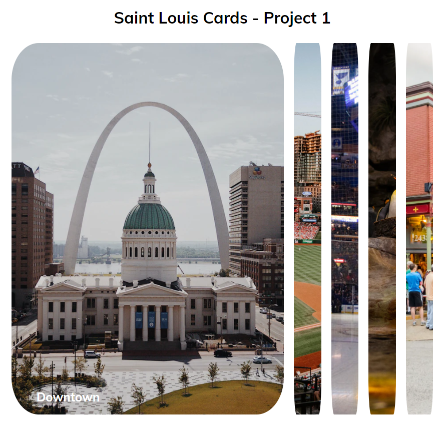
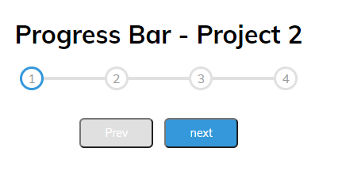

# Web Dev Projects
This will be the home for all of my web development projects from my udemy 50 projects in 50 days course.
My current plan is to knock out one of these assignments a day, in conjuction with a section from my introduction to web development course. 
As of starting this repository I am just over halfway through the intro to web dev course. So I have a base understanding of most web front end web development concepts.

## Project 1 - Expanding Cards
### Description
A simple project where a main card is active and takes up a majority of the page. As you click on the other smaller cards, they will grow to the size of the page and the previously active one will shrink.

### Lesson Learned
This project reinforced some basics on grabbing items within the dom and forced me to use more flexbox properties as I have mostly been using bootstrap.  It also helped to get some more practice with adding and removing css classes.

## Project 2 - Progress Bar
### Description
In this project I made 4 circles and a line to represent where you were in the completion of a form. As you clicked next the bar would grow to the next circle and activate that circle. 

### Lesson Learned
This porject introduced how to make variables within css. This was a really convenient option for duplicating colors for multiple objects. Learning how to manipulate a div to represent a line was also very helpful. I intend to implement this for the website I create.
                                                                   
